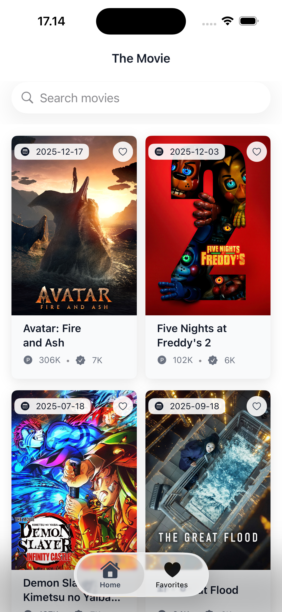
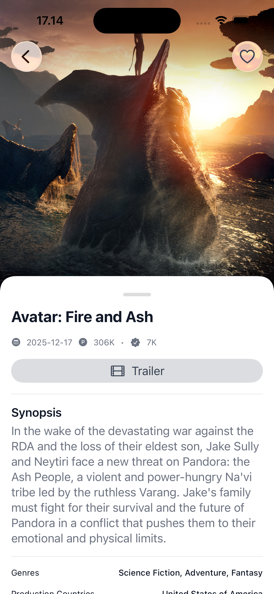

# The Movie iOS App 🎬


**The Movie** is a modern iOS application offering an immersive experience for browsing popular movies, searching for favorites, and managing a personal watchlist. Built with **SwiftUI** and **SwiftData**, it demonstrates robust offline-first architecture and Swift 6 concurrency compliance.

---

## ✨ Features

- **Browse Movies**: Discover popular movies with infinite scrolling pagination.
- **Search**: Real-time movie search functionality with auto-reset behavior.
- **Persistent Favorites**: A dedicated `FavoriteMovieEntity` ensures your marked movies are never lost, even when clearing the popular movie cache.
- **Pull to Refresh**: Force a fresh data sync from TMDB while bypassing local cache.
- **Splash Screen**: Premium animated entry screen to improve launch perception.
- **Error Handling**: Comprehensive error capturing with user-friendly alerts across all screens.
- **Rich Details**: View comprehensive movie info including genres, production companies, and trailers (YouTube integration).
- **Responsive UI**: Optimized layouts using `LazyVGrid`, modern SwiftUI transitions, and clear Empty States.

## 📱 Demo

### App Preview

| List View | Detail View |
|:---------:|:-----------:|
|  |  |

## 🛠 Tech Stack

- **Language**: Swift 6
- **UI Framework**: SwiftUI
- **Data Persistence**: SwiftData (`@Model`, `ModelContext`)
- **Networking**: Alamofire
- **Image Caching**: Kingfisher
- **Concurrency**: Swift 6 Strict Concurrency (`@MainActor`, `Sendable`)
- **Testing**: XCTest (Unit Tests) & XCUITest (UI Tests)

## 🏗 Architecture

The app follows a Clean Architecture approach with MVVM:

1.  **Presentation Layer**:
    *   **Views**: SwiftUI Views (`ListMovieView`, `DetailMovieView`).
    *   **ViewModels**: Manage state and business logic (`@Observable`).
2.  **Domain/Data Layer**:
    *   **Repository**: Mediates between Remote and Local data sources (`MovieRepository`).
    *   **Data Sources**:
        *   `NetworkService`: Fetches data from TMDB API.
        *   `MovieLocalDataSource`: Handles SwiftData CRUD operations.
3.  **Dependency Injection**: Simple DI Container (`AppContainer`) for managing dependencies.

## 🚀 Getting Started

### Prerequisites
- Xcode 15.0 or later
- iOS 17.0+ Simulator/Device

### Installation

1.  **Clone the repository**
    ```bash
    git clone https://github.com/username/TheMovie.git
    cd TheMovie
    ```

2.  **Open in Xcode**
    ```bash
    open TheMovie.xcodeproj
    ```

3.  **Build and Run**
    - Select your target simulator.
    - Press `Cmd + R` to run.

## 🧪 Testing

The project includes a comprehensive test suite.

### Unit Tests
Verify ViewModels and Logic layers.
- **Run**: `Cmd + U`
- **Coverage**: `ListMovieViewModel`, `DetailMovieViewModel`, `FavoriteMovieViewModel`.

### UI Tests
Verify critical user flows (Smoke Tests).
- **Flow**: Launch -> Scroll List -> Open Detail -> Toggle Favorite -> Back.
- **Run**: Select `TheMovieUITests` target and test.

## 📂 Project Structure

```
TheMovie/
├── App/
│   ├── TheMovieApp.swift      # Entry Point
│   └── AppContainer.swift     # DI Container
├── Data/
│   ├── Local/                 # SwiftData Entities & DataSource
│   ├── Remote/                # API Service & Response Models (NetworkService)
│   ├── Repository/            # Repository Implementation
│   └── DTO/                   # Data Transfer Objects
├── Features/
│   ├── List/                  # Movie List Screen
│   ├── Detail/                # Movie Detail Screen
│   └── Favorites/             # Favorites Screen
├── Shared/
│   ├── Components/            # Reusable UI Components
│   ├── Extensions/            # Swift Extensions
│   └── Utils/                 # Helper Functions
└── Assets.xcassets            # Images & Colors
```


